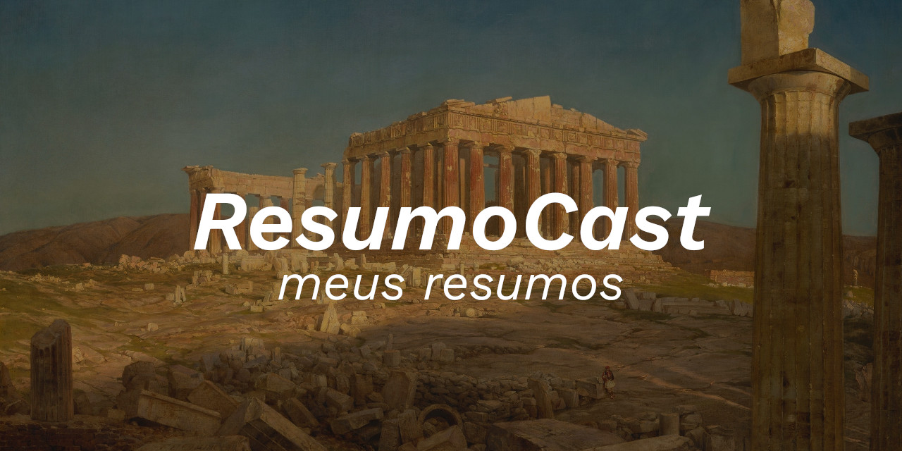

 

<b>Note:</b> this document is written in PT-BR 🇧🇷

 

Estes são meus resumos dos vídeos do canal [Resumo Cast](https://www.youtube.com/c/Resumocast), que é simplesmente o melhor canal sobre empreendedorismo e questões de mercado do mundo (sim, pra mim é isso mesmo).

Para quem não conhece o Resumo Cast, ele é um Podcast criado por [João Cristofolini](https://www.joaocristofolini.com.br/), onde ele e seu amigo [Gustavo Carriconde](https://www.linkedin.com/in/gustavocarriconde) fazem vídeos sobre resumos dos mais variados livros de empreendedorismo e mercado de modo geral.

Livros como "O poder do hábito", "As armas da persuasão", "Como convencer alguém em 90 segundos", "Os segredos da mente milionária", e literalmente centenas de outros livros, são abordados e resumidos de maneira clara e objetiva.

Eu pessoalmente sou fã deles e gosto muito do trabalho que eles fizeram, pra mim é simplesmente fantástico. Logo, decidi que seria legal disponibilizar os resumos que faço (para mim) aqui no Github, talvez seja útil para mais pessoas 😉

Vale lembrar que como eu faço estes resumos para me ajudar em meus estudos, talvez eles fiquem sintéticos (ou grandes) demais, então não espere muita formalidade.

Também vale lembrar que por vezes eu adiciono algum insight no resumo, ou alguma contribuição ao tema que me parece boa, afinal, estes resumos são exatamente para mim, então coloco neles tudo que entendo ser o melhor para minha vida terrena e para minha alma, então caso você não se identifique com algo, ignore. Em todo caso, boa leitura 😀

 

 

<b>Segue abaixo a lista dos resumos:</b>

- <a href="resumos/1 - O Poder do Hábito - Charles Duhigg.md" >O Poder do Hábito - Charles Duhigg</a>
- <a href="resumos/2 - O milagre da manhã - Hal Elrod.md">O milagre da manhã - Hal Elrod</a>
- <a href="resumos/3 - As armas da persuasão - Robert B. Cialdini.md">As armas da persuasão - Robert B. Cialdini</a>
- <a href="resumos/4 - Os 7 Hábitos das Pessoas Altamente Eficazes - Stephen Covey.md">Os 7 Hábitos das Pessoas Altamente Eficazes - Stephen Covey</a>
- <a href="resumos/5 - Como Convencer Alguém em 90 Segundos - Nicholas Boothman.md">Como Convencer Alguém em 90 Segundos - Nicholas Boothman</a>
- <a href="resumos/6 - Foco - Daniel Goleman.md">Foco - Daniel Goleman</a>
- <a href="resumos/7 - Os Segredos da Mente Milionária - T. Harv Eker.md">Os Segredos da Mente Milionária - T. Harv Eker</a>
- <a href="resumos/8 - Como Fazer Amigos e Influenciar Pessoas - Dale Carnegie.md">Como Fazer Amigos e Influenciar Pessoas - Dale Carnegie</a>

